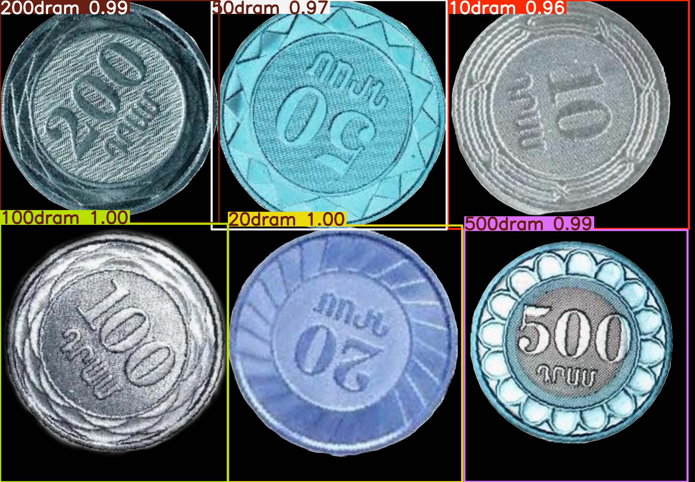

# Automated Armenian Coin Detection

This project implements an automated system for detecting and classifying Armenian coins using deep learning models, particularly focusing on object detection with YOLO and image classification using CNNs. The system is designed to identify coins in both static images and video feeds, making it applicable to various use cases such as vending machines, kiosks, and automated payment systems.

## Project Overview

The goal of this project is to develop an accurate and efficient model for recognizing Armenian coins using computer vision. The system utilizes YOLO (You Only Look Once) for object detection and CNN (Convolutional Neural Networks) for image classification.

### Technologies Used
- **YOLOv5**: Used for real-time coin detection in both static images and videos.
- **FastAI**: Used for building and fine-tuning a CNN for coin classification.
- **TensorFlow**: Integrated for fine-tuning CNN models.
- **Python**: Core programming language used for model development.
- **OpenCV**: Used for image and video processing.

### Features
- **Coin Detection**: Detects different Armenian coin denominations in both images and videos.
- **Object Tracking**: Tracks coins in video feeds.
- **Model Fine-Tuning**: Utilizes transfer learning to improve model performance using pre-trained models.
- **Real-time Performance**: Optimized for both image and video detection in real-time.

## Files in the Repository

- **Dataset.zip**: Contains the coin dataset used for training the models. Includes images of Armenian coins with labeled annotations.
- **YOLOmodel.pt**: The trained YOLO model for coin detection in images.
- **coins_detection_CNN.ipynb**: Jupyter notebook implementing the CNN-based coin detection and classification model.
- **coins_detection_YOLO.py**: Python script implementing YOLO for detecting Armenian coins in static images and video feeds.
- **README.md**: Project documentation with setup instructions.

## Instructions for Running the Code

### Prerequisites
1. Install the required Python packages:
    ```bash
    pip install -r requirements.txt
    ```

2. Download the dataset by extracting the `Dataset.zip` file into your project directory.

3. Ensure you have the necessary hardware (e.g., GPU support) to run YOLO models effectively.

### Running the YOLO Model
1. Download the pre-trained YOLO model (`YOLOmodel.pt`).
2. Run the YOLO model for coin detection:
    ```bash
    python coins_detection_YOLO.py
    ```

### Running the CNN Model
1. Open the `coins_detection_CNN.ipynb` file in a Jupyter Notebook environment.
2. Follow the steps in the notebook to load the dataset, train, and test the CNN model.

## Results

Here is an example of the results produced by the YOLO model for coin detection in images:



## Future Enhancements

- Improve the accuracy of coin detection by adding more diverse images in the dataset.
- Optimize the models for edge devices such as Raspberry Pi.
- Extend the functionality to handle paper-based currency detection.
  
